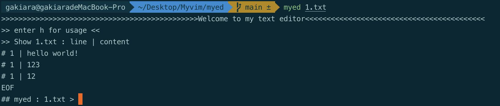
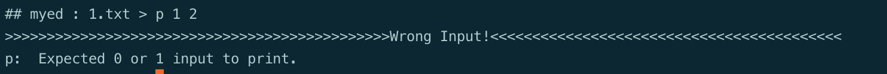
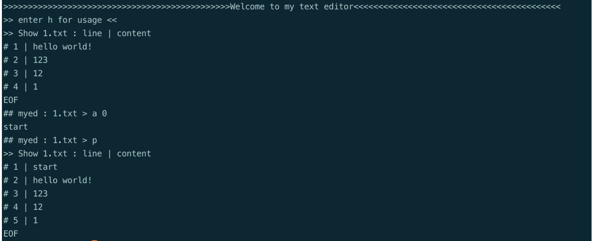
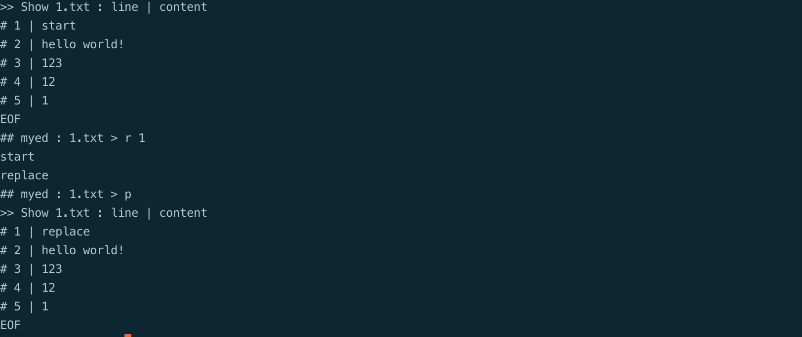
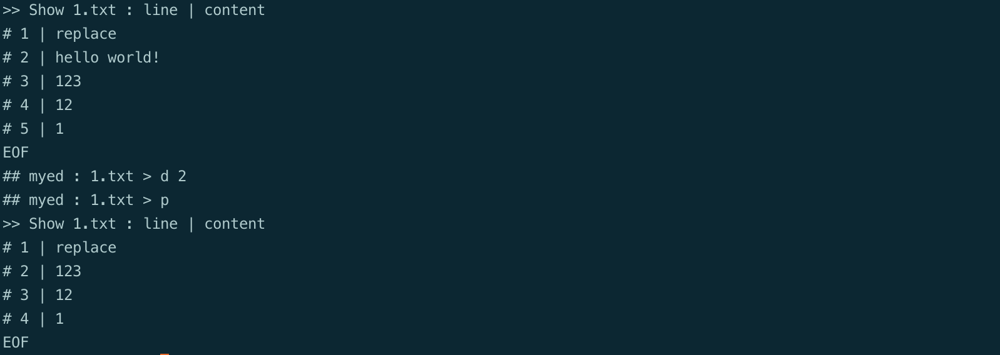
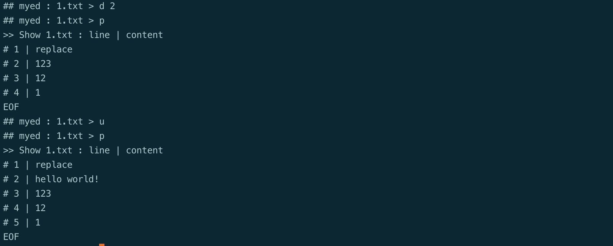
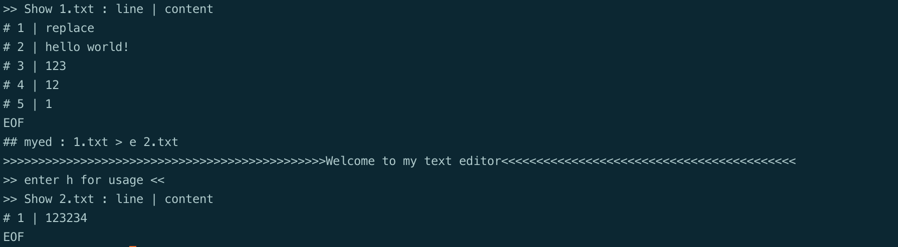
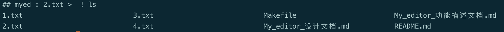

## My_editor_功能描述文档

#### 1. File Structure:

**如果使用 `macos` 要注意，先下载 `gnu-sed` ，把代码里的 `sed` 换成 `gsed` **

**如果使用 `Linux` ，则把 `gsed` 换回 `sed`** 

下载文件，文件夹里有：

-function.sh

-myed.sh

-Makefile

-My_editor_功能描述文档.md

-My_editor_设计文档.md

#### 2. Setting & Start:

- 进入命令行：

```shell
make
make install
#将下面这一行添加到你的～/.bashrc或者~/.vimrc中：
export PATH=$HOME/bin:$PATH
```

- 此时我们就可以直接输入`myed`命令来运行我们的文件编辑器了：

```shell
#example
myed 1.txt
#若1.txt文件存在则会自动打开1.txt并输出文件内容，若不存在则新建一个名为1.txt的文件
#文件的格式：
#行数 | 内容
#EOF
```

例子：

刚进入的时候，默认输出一次文件内容：



使用过程中可以输入`Ctrl+c`强制结束：

#### 3. Usage:

进入了myed的界面后：

- **帮助**

  `h`  :  输出usage

- **打印选项：**

  `p`  :  打印整个文件

  `p [#line number]`  :  打印某一行

  

- **行操作：**

  `a` ：在文档最后面增加内容

  `a [#line number]` ：在某一行后面增加内容

  exp：输入`a 0`，在第一行输入`start`

  

  `r [#line number]` ：替换某一行内容为你输入的

  exp: 

  输入`r 1`，将start 替换成 replace 

  

  `d [[#line number]`：删除某一行

  exp：

  输入`d 2`：删除掉第二行

  

  - 行输入的时候，换行输入`enter`
  - 写完最后一行后，再输入`enter` 和 `ctrl+c` 来完成文本的输入
  - 输入0为第一行，-1为最后一行

- **文件操作：**

  `u` ：撤回上一步操作

  exp：退回到没有删除之前

  

  `e [#new file name]` ：关闭当前文件，打开新的文件

  exp：输入e 2.txt切换到2.txt文本 

  

  `q` ：退出不保存

  退出前会有一个确认是否不保存修改的文件退出以防出错：

  `w` ：保存文件

  `wq` ：保存并退出

- **命令行：**

  `! [COMMAND]` ：在myed中运行控制行的命令

