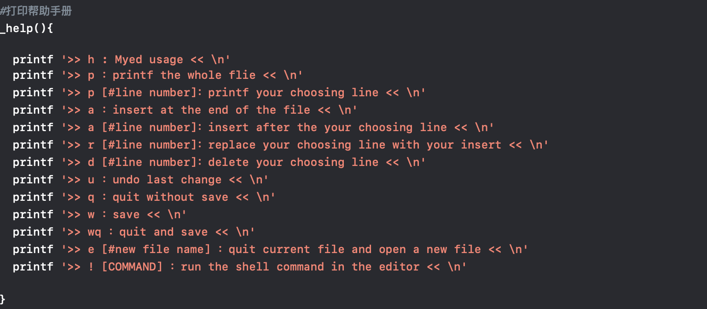

## My_editor_设计文档

#### 1. 设计思想:

​      设计想法参照ed-editor，使用选择行的方式，输入一行或多行的文本。

​      准备original file，working file，backup file：

​      --original file：原始文件，实际操作时不改变其内容，只有save时候才写入；

​      --working file：工作文件，实际操作的文件，save的时候将其写入original文件，退出时删除；

​      --backup file：备份文件，备份上一步操作的文件，使得可以撤回

#### 2. 功能模块:

主要使用了函数的架构：

- 帮助手册：输出用户指南

-  备份函数 ：working file的内容输出到backup中

- 输出文件某一行函数：

- 输出文件所有内容： 

- 输入函数 ：两个变量，输入的内容 _text 和行数 _n

实际使用的时候：先备份，再输出第n行，将输出的内容输入到working_file中实现文件的修改

- 替代函数：两个变量，输入的内容 _text 和行数 _n

实际使用的时候：先备份，再输出第n行，将输出的内容输入到working_file中实现文件的某行内容的替换

- 确认没有保存是否退出，防止因为忘记保存而退出

- 主函数：不断循环读入指令

#### 3. 数据结构:

没有用到什么特别的数据结构，所以在此不赘述。

#### 4. 算法：

主要用的是运用case来进行指令行数的选择，没有什么特别的算法

